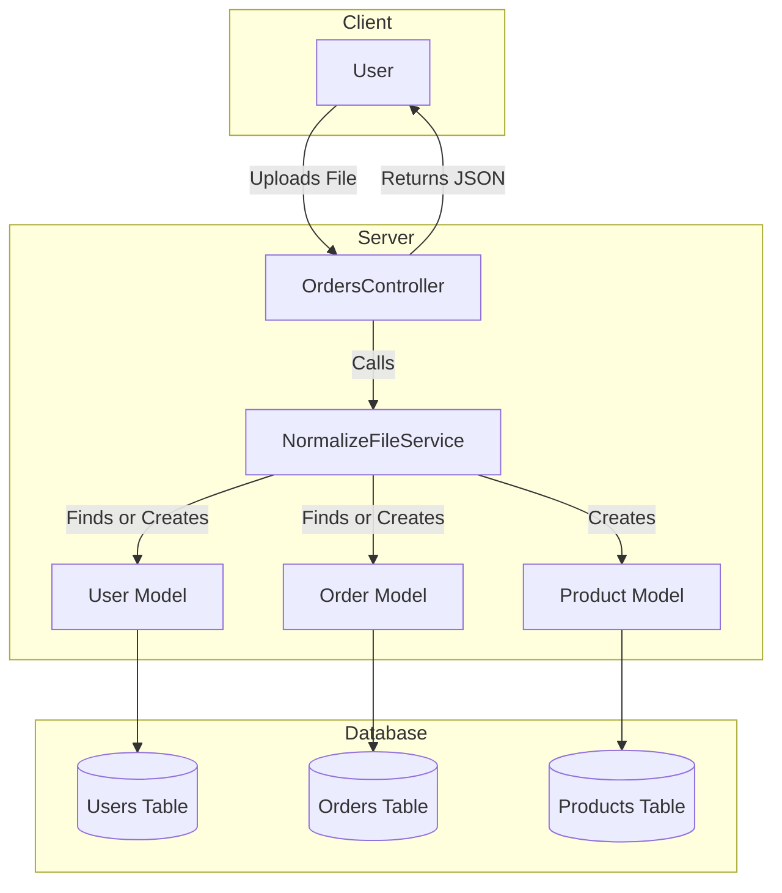

# README

This README would normally document whatever steps are necessary to get the
application up and running.

Things you may want to cover:
# Architecture Diagram



This diagram shows the flow of data from the user uploading a file to the server processing it and interacting with the database, and finally returning a JSON response to the user. 

**Ruby version**
- 3.3.6

**System dependencies**
- Lightweight and flexible command-line JSON processor
```shell
brew install jq
```

**Configuration**
```shell 
git clone git@github.com:enogrob/order_normalizer_api.git
cd order_normalize_api
bundle
```

**How to run the test suite**
```shell
bundle exec rspec
```

**Services (job queues, cache servers, search engines, etc.)**

**Deployment instructions**

**How to run with API Endpoints**
Start Ruby on Rails in one Terminal:
```shell
bin/dev
```

Perform below in the other Terminal:
Upload Order File
* URL: /orders/upload
* Method: POST
Params:
* file: The order file to be uploaded.
Response:
* 200 OK: Successfully processed the file.
* 422 Unprocessable Entity: Error processing the file.
Examples:
```shell
curl -X POST -F "file=@data_1.txt" http://localhost:3000/orders/upload | jq '.'
curl -X POST -F "file=@data_2.txt" http://localhost:3000/orders/upload | jq '.'
curl -X POST -F "file=@data_invalid.txt" http://localhost:3000/orders/upload | jq '.'
curl -X POST -F "file=@data_empty.txt" http://localhost:3000/orders/upload | jq '.''.'
```

Error Handling
* If the uploaded file is empty, the API will return a 422 Unprocessable Entity status with the message "The file is empty."
* If there is an error parsing the file, the API will return a 422 Unprocessable Entity status with the error message.

List Orders
* URL: /orders
* Method: GET
Params:
* id (optional): Filter orders by ID.
* start_date (optional): Filter orders by start date.
* end_date (optional): Filter orders by end date.
Response:
* 200 OK: List of orders.
Examples:
```shell
curl "http://localhost:3000/orders?id=628" | jq '.'
curl "http://localhost:3000/orders?start_date=2021-01-01&end_date=2021-12-31" | jq '.'
```


<!-- **Additional Information**
* This application uses Solid Queue for job processing and Solid Cache for caching.
* The application is configured to run in a Docker container for production deployment. -->

