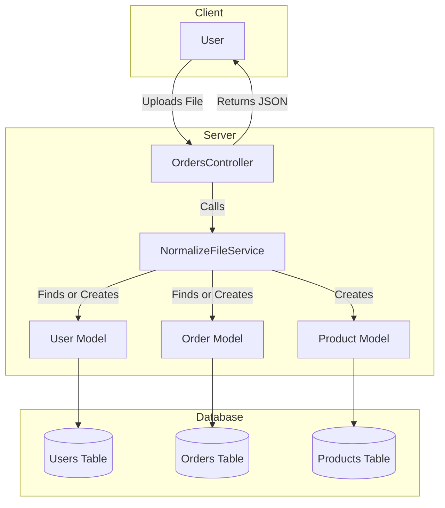
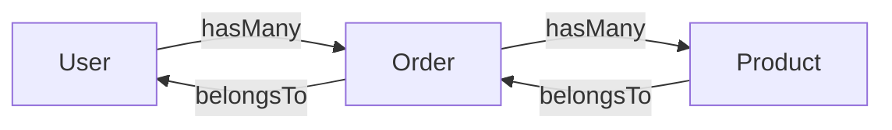

# README

`order_normalizer_api` is a Ruby on Rails REST API designed to process and normalize legacy data files. It accepts files as input, normalizes the data, and returns the processed output, utilizing flexible persistence methods like file storage, databases, or streams. The API supports order querying with filters for order ID and purchase date ranges, ensuring robust functionality through adherence to SOLID design principles.

# Architecture Diagram



This diagram shows the flow of data from the user uploading a file to the server processing it and interacting with the database, and finally returning a JSON response to the user. 



Here there is the Models relationships diagram.

This project adheres to SOLID principles, ensuring robustness, scalability, and maintainability.

**Ruby version**
- 3.3.6

**System dependencies**
- Lightweight and flexible command-line JSON processor
```shell
brew install jq
```

**Configuration**
```shell 
git clone git@github.com:enogrob/order_normalizer_api.git
cd order_normalize_api
```

```shell
rails db:migrate
```

```shell
bundle
```

**How to run the test suite**

Run your tests  using rspec. 
```shell
bundle exec rspec
```

`SimpleCov` will generate a coverage report in the coverage directory.
Open the `index.html` file in the coverage directory in your browser to view the test coverage report.
```shell
open coverage/index.html
```

**Services (job queues, cache servers, search engines, etc.)**

**Deployment instructions**

**How to run with API Endpoints**
Start Ruby on Rails in one Terminal:
```shell
bin/dev
```

Perform below in the other Terminal:
Upload Order File
* URL: /orders/upload
* Method: POST
Params:
* file: The order file to be uploaded.
Response:
* 200 OK: Successfully processed the file.
* 422 Unprocessable Entity: Error processing the file.
Examples:
```shell
curl -X POST -F "file=@data_1.txt" http://localhost:3000/orders/upload | jq '.'
```

```shell
curl -X POST -F "file=@data_2.txt" http://localhost:3000/orders/upload | jq '.'
```

```shell
curl -X POST -F "file=@data_invalid.txt" http://localhost:3000/orders/upload | jq '.'
```

```shell
curl -X POST -F "file=@data_empty.txt" http://localhost:3000/orders/upload | jq '.''.'
```

Error Handling
* If the uploaded file is empty, the API will return a 422 Unprocessable Entity status with the message "The file is empty."
* If there is an error parsing the file, the API will return a 422 Unprocessable Entity status with the error message.

List Orders
* URL: /orders
* Method: GET
Params:
* id (optional): Filter orders by ID.
* start_date (optional): Filter orders by start date.
* end_date (optional): Filter orders by end date.
Response:
* 200 OK: List of orders.
Examples:
```shell
curl "http://localhost:3000/orders?id=628" | jq '.'
```

```shell
curl "http://localhost:3000/orders?start_date=2021-01-01&end_date=2021-12-31" | jq '.'
```