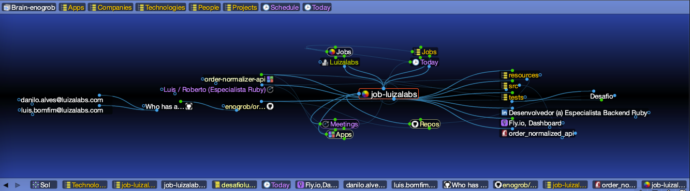
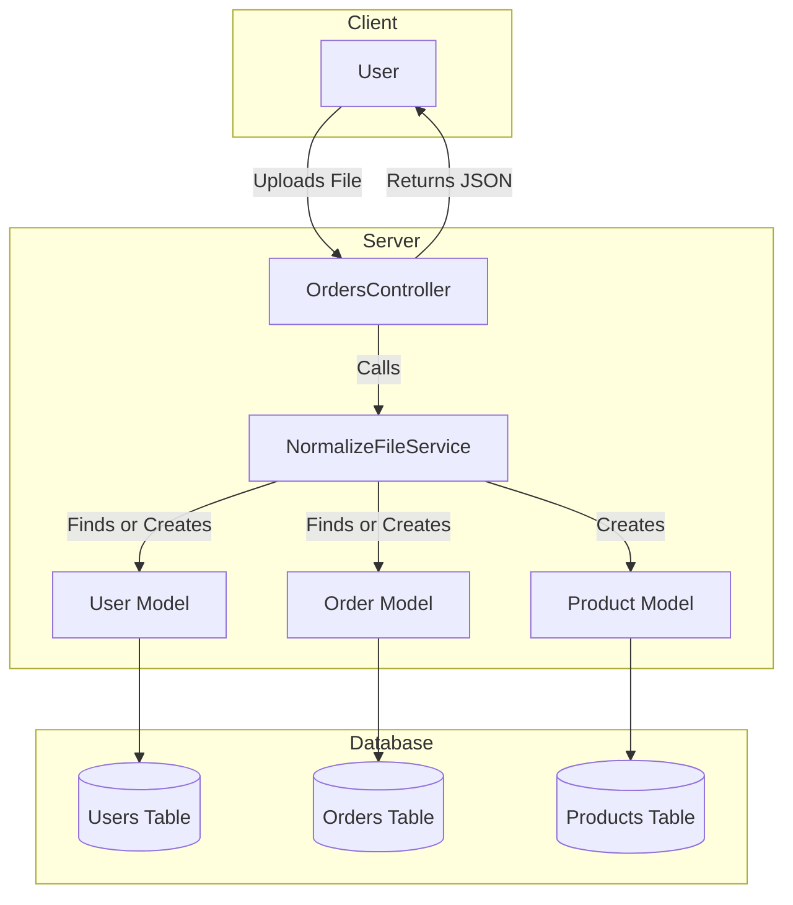
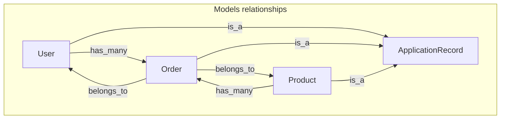
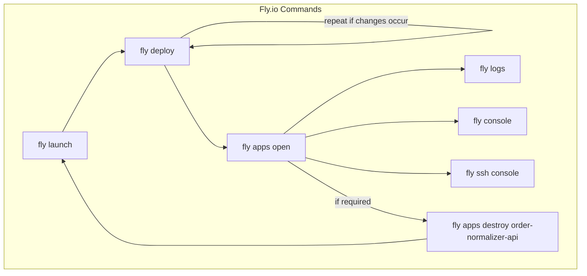
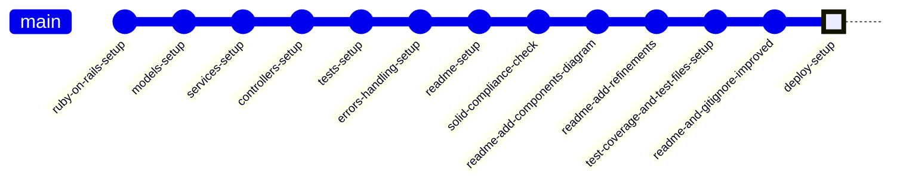

# README



```
Author  : Roberto Nogueira
Date    : 2024-11
Project : Order Normalizer API
```

Author profile can be accessed in [LinkedIn](https://www.linkedin.com/in/enogrob/), and the Repo was created in 
[Github](https://github.com/enogrob/order_normalizer_api). 
See if required the 
[Luizalabs](https://www.linkedin.com/company/luizalabs/posts/?feedView=all) job 
[Job Description](https://www.linkedin.com/jobs/search/?currentJobId=4071757766&f_C=10435733&geoId=92000000&origin=COMPANY_PAGE_JOBS_CLUSTER_EXPANSION&originToLandingJobPostings=4083026839%2C4071757766%2C4084141403%2C4077188554%2C4083348762%2C4083025603%2C4083029211%2C4083029455%2C4083022862)

---

The `order_normalizer_api` is a Ruby on Rails REST API designed to process and normalize legacy data files. 
It accepts files as input, normalizes the data, and returns the processed output, utilizing flexible persistence methods like file storage, databases, or streams. 
The API supports order querying with filters for order ID and purchase date ranges, ensuring robust functionality through adherence to SOLID design principles.

## Architecture Diagram



This diagram shows the flow of data from the user uploading a file to the server processing it and interacting with the database, and finally returning a JSON response to the user. 



Here there is the Models relationships diagram.

This project adheres to SOLID principles, ensuring robustness, scalability, and maintainability.


## System dependencies

- [Asdf](https://asdf-vm.com), [Ruby](https://www.ruby-lang.org/en/news/2024/11/05/ruby-3-3-6-released/), [Rails](https://rubyonrails.org/) and [Nodejs](https://nodejs.org/en).
```shell
brew install asdf
echo ". /usr/local/opt/asdf/libexec/asdf.sh" >> $HOME/.zshrc
source $HOME/.zshrc
asdf plugin add ruby
asdf plugin add nodejs
asdf install ruby 3.3.6
asdf install nodejs 23.2.0
asdf global ruby 3.3.6
asdf global nodejs 23.2.0
gem install rails -v '8.0.0'
```
- [Jq](https://jqlang.github.io/jq) Lightweight and flexible command-line JSON processor.
```shell
brew install jq
```
- [Fly.io]() and [Docker](https://www.docker.com/products/docker-desktop).
```shell
brew install flyctl
curl -L https://fly.io/install.sh | sh
echo "export FLYCTL_INSTALL=/Users/enogrob/.fly" >> $HOME/.zshrc
echo "export PATH=\$FLYCTL_INSTALL/bin:\$PATH" >> $HOME/.zshrc
brew install --cask docker
source $HOME/.zshrc
``` 

## Configuration
```shell 
git clone git@github.com:enogrob/order_normalizer_api.git
cd order_normalize_api
```

```shell
rails db:migrate
```

```shell
bundle
```
```shell
:
Bundle complete! 16 Gemfile dependencies, 111 gems now installed.
Use `bundle info [gemname]` to see where a bundled gem is installed.
```

### How to run the test suite

Run your tests  using rspec. 
```shell
bundle exec rspec
```
```shell
:
OrdersController
  POST #upload
    with valid file
      returns a successful response
    with invalid file
      returns an error response
    with empty file
      returns a successful response with an empty array
  GET #index
    returns a list of orders
    filters orders by id
    filters orders by date range

NormalizeFileService
  .process
    with valid file
      processes the file successfully
    with invalid file
      raises InvalidFileFormatError
    with empty file
      raises InvalidFileFormatError

Finished in 0.37095 seconds (files took 3.26 seconds to load)
9 examples, 0 failures

Coverage report generated for RSpec to /Volumes/data/enogrob/Things/Projects/job-luizalabs/src/order_normalizer_api/coverage.
Line Coverage: 90.32% (56 / 62)
```

`SimpleCov` will generate a coverage report in the coverage directory.
Open the `index.html` file in the coverage directory in your browser to view the test coverage report.
```shell
open coverage/index.html
```
```shell
:
All Files ( 90.32% covered at 1.95 hits/line )
10 files in total.
62 relevant lines, 56 lines covered and 6 lines missed. ( 90.32% )
:
File	                                  % covered	 Lines	Relevant Lines	Lines covered	Lines missed	Avg. Hits / Line
:
app/controllers/application_controller.rb 100.00 %	   2	             1	            1	           0	            1.00
app/controllers/orders_controller.rb      100.00 %	  36 	            16	           16	           0	            2.25
app/errors/invalid_file_format_error.rb   100.00 %     5	             3	            3	           0	            1.67
app/models/application_record.rb          100.00 %	   3	             2	            2	           0	            1.00
app/models/order.rb                       100.00 %	   4	             3	            3	           0	            1.00
app/models/product.rb                     100.00 %	   3	             2	            2	           0	            1.00
app/models/user.rb                        100.00 %	   3	             2	            2	           0	            1.00
app/services/normalize_file_service.rb    100.00 %	  52	            27	           27	           0	            2.59
```

### How to run with API Endpoints
Start Ruby on Rails in one Terminal:
```shell
bin/dev
```
```shell
:
=> Booting Puma
=> Rails 8.0.0 application starting in development 
=> Run `bin/rails server --help` for more startup options
Puma starting in single mode...
* Puma version: 6.5.0 ("Sky's Version")
* Ruby version: ruby 3.3.6 (2024-11-05 revision 75015d4c1f) [x86_64-darwin23]
*  Min threads: 3
*  Max threads: 3
*  Environment: development
*          PID: 27538
* Listening on http://127.0.0.1:3000
* Listening on http://[::1]:3000
Use Ctrl-C to stop
```

Perform below in the other Terminal:
Note:
When running locally 
```shell
HOST_API=https://localhost:3000

```

When running the deployed
```shell
HOST_API=https://order-normalizer-api.fly.dev
```

Upload Order File
* URL: /orders/upload
* Method: POST
Params:
* file: The order file to be uploaded.
Response:
* 200 OK: Successfully processed the file.
* 422 Unprocessable Entity: Error processing the file.
Examples:
```shell
curl -X POST -F "file=@data_1.txt" $HOST_API/orders/upload | jq '.'
```
```json
:
{
    "user_id": 62,
    "name": "Jonah Satterfield",
    "orders": [
      {
        "order_id": 673,
        "total": "851.01",
        "date": "2021-08-29",
        "products": [
          {
            "product_id": 3,
            "value": 851.01
          }
        ]
      }
    ]
  }
]
```

```shell
curl -X POST -F "file=@data_2.txt" $HOST_API/orders/upload | jq '.'
```
```json
:
{
    "user_id": 199,
    "name": "Miss Terry Boyle",
    "orders": [
      {
        "order_id": 1829,
        "total": "1263.59",
        "date": "2021-06-25",
        "products": [
          {
            "product_id": 3,
            "value": 1263.59
          }
        ]
      }
    ]
  }
]
```

```shell
curl -X POST -F "file=@data_invalid.txt" $HOST_API/orders/upload | jq '.'
```
```json
{
  "error": "Error parsing line: 1234567890John Doe                         12345678901234567890123456789012345678901234567890123456789012345678901234567890\n. Error: invalid date"
}
```

```shell
curl -X POST -F "file=@data_empty.txt" $HOST_API/orders/upload | jq '.'
```
```json
{
  "error": "The file is empty."
}
```

Error Handling
* If the uploaded file is empty, the API will return a 422 Unprocessable Entity status with the message "The file is empty."
* If there is an error parsing the file, the API will return a 422 Unprocessable Entity status with the error message.

List Orders
* URL: /orders
* Method: GET
Params:
* id (optional): Filter orders by ID.
* start_date (optional): Filter orders by start date.
* end_date (optional): Filter orders by end date.
Response:
* 200 OK: List of orders.
Examples:
```shell
curl "$HOST_API/orders?id=628" | jq '.'
```
```json
[
  {
    "order_id": 628,
    "total": "4132.24",
    "date": "2021-03-08",
    "products": [
      {
        "product_id": 4,
        "value": "1396.87"
      },
      {
        "product_id": 3,
        "value": "1940.89"
      },
      {
        "product_id": 4,
        "value": "794.48"
      }
    ]
  },
  {
    "order_id": 628,
    "total": "804.47",
    "date": "2021-09-11",
    "products": [
      {
        "product_id": 4,
        "value": "804.47"
      }
    ]
  }
]
```

```shell
curl "$HOST_API/orders?start_date=2021-01-01&end_date=2021-12-31" | jq '.'
```
```json
:
 {
    "order_id": 702,
    "total": "1419.69",
    "date": "2021-07-18",
    "products": [
      {
        "product_id": 2,
        "value": "1419.69"
      }
    ]
  },
  {
    "order_id": 1842,
    "total": "1382.56",
    "date": "2021-04-04",
    "products": [
      {
        "product_id": 4,
        "value": "1382.56"
      }
    ]
  }
]
```

### Services (job queues, cache servers, search engines, etc.)

### Deployment instructions

Deploying a Ruby on Rails app to [Fly.io](https://fly.io) involves using the [flyctl CLI](https://fly.io/docs/flyctl/install/) to initialize a project (also [Docker](https://www.docker.com/products/docker-desktop/) is required), generate a `fly.toml` file, containerize the app with Docker, and push it to [Fly.io](https://fly.io). Once deployed, the app goes live with provisioned resources. You can monitor logs, scale instances, and manage secrets with [Fly.io](https://fly.io) commands.



This diagram captures the workflow and emphasizes the iterative nature of fly deploy if changes are made to the application.

## Git Graph



## References

Here are some valuable resources for the technologies used in this project:

1. **Ruby on Rails**
   - [Official Ruby on Rails Guides](https://guides.rubyonrails.org/)
   - [Ruby on Rails API Documentation](https://api.rubyonrails.org/)
   - [RailsCasts](http://railscasts.com/)

2. **RSpec**
   - [Official RSpec Documentation](https://rspec.info/documentation/)
   - [Better Specs](http://www.betterspecs.org/)

3. **SimpleCov**
   - [SimpleCov GitHub Repository](https://github.com/simplecov-ruby/simplecov)
   - [SimpleCov Documentation](https://github.com/simplecov-ruby/simplecov#readme)

4. **Fly.io**
   - [Fly.io Documentation](https://fly.io/docs/)
   - [Fly.io GitHub Repository](https://github.com/superfly/flyctl)

5. **Docker**
   - [Docker Documentation](https://docs.docker.com/)
   - [Docker Hub](https://hub.docker.com/)

6. **Git**
   - [Pro Git Book](https://git-scm.com/book/en/v2)
   - [Git Documentation](https://git-scm.com/doc)

7. **Mermaid**
   - [Mermaid Documentation](https://mermaid.js.org/intro/)
   - [Mermaid Github Repository](https://github.com/mermaid-js/mermaid)
